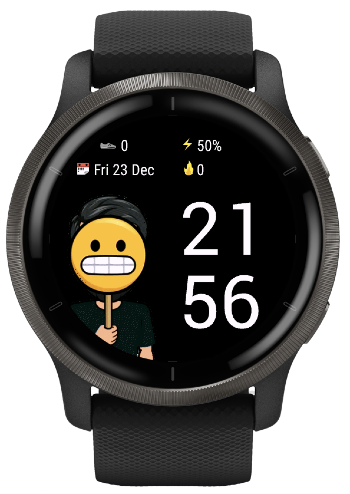

# Garmin watchface
The first test of Garmin watch face implementation for model Venu 2.

## Supported devices
- Venu 2

## Latest UI version

## Side load watchface
- open the project in VS Code
- download recommended extensions
- build the watchface for device `Monkey C: Build for Device`
- open storage of your device on `GARMIN/APP` (use Android File Transfer on OS X)
- copy `.PRG` file on your device